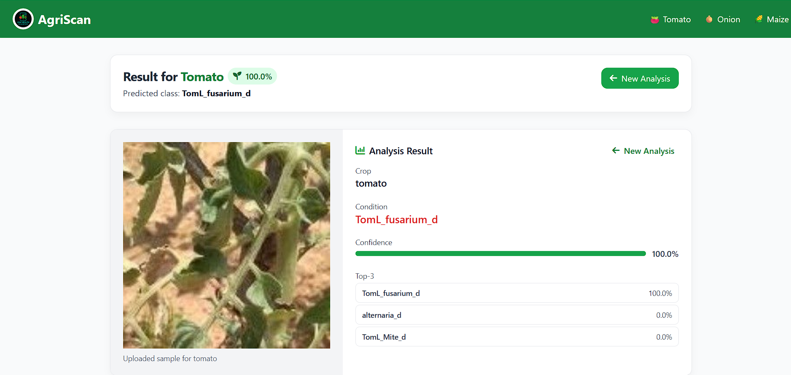
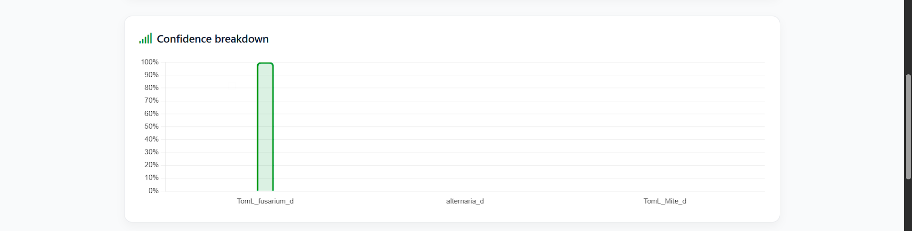
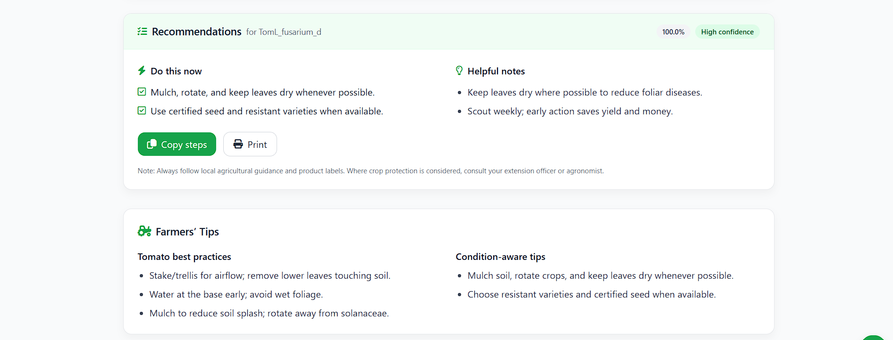
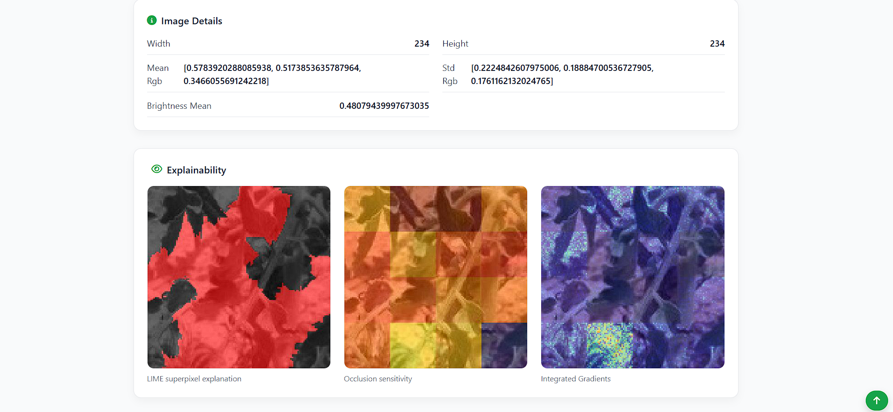
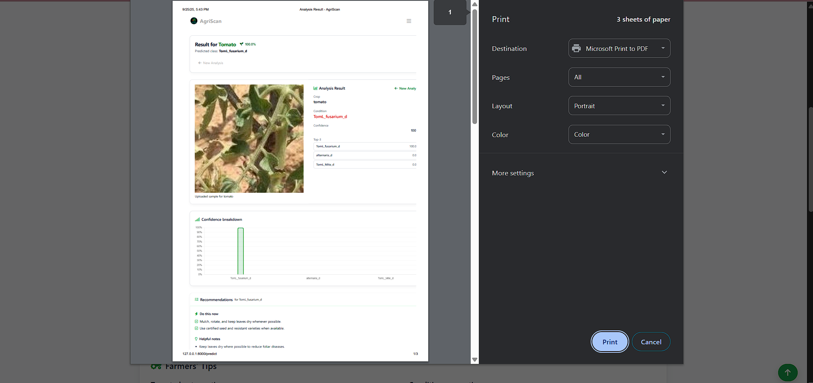
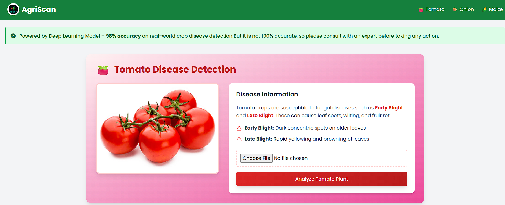
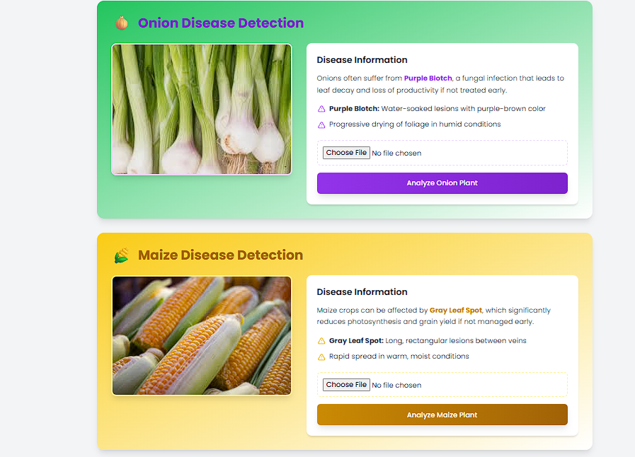
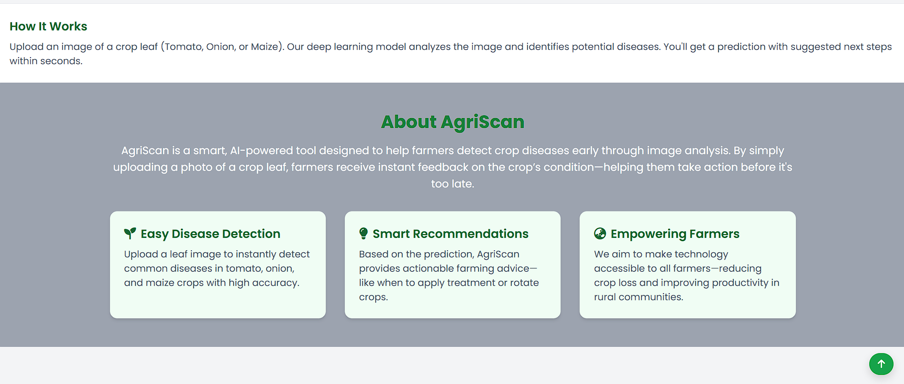
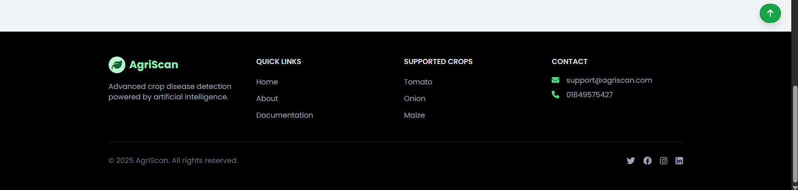

# 🌱 AgriScan - AI-Powered Crop Health Analysis

AgriScan is an intelligent agricultural application that uses Vision Transformer (ViT) models to analyze crop images and detect diseases in real-time. The application provides comprehensive disease identification, confidence scoring, and visual explanations to help farmers and agricultural experts make informed decisions.

## 🎯 Features

### Core Functionality
- **Multi-Crop Support**: Analyze onion, tomato, and maize crops
- **Disease Detection**: Identify various diseases and health conditions
- **AI Explanations**: Get visual explanations using LIME, Occlusion Heatmaps, and Integrated Gradients
- **Confidence Scoring**: Detailed confidence metrics and top-3 predictions
- **Image Analysis**: Comprehensive image statistics and preprocessing

### Disease Classification Support

#### 🧅 Onion
- Alternaria Disease
- Fusarium Disease  
- Healthy Leaf
- Virosis Disease

#### 🍅 Tomato
- Blossom End Rot
- Bacterial Floundering
- Mite Damage
- Alternaria Mite
- Fusarium Disease
- Healthy Leaf
- Virosis Disease
- Alternaria Disease
- Excess Nitrogen
- Healthy Fruit
- Sunburn Damage
- Late Blight

#### 🌽 Maize
- Abiotic Disease
- Curvularia Disease
- Healthy Leaf
- Helminthosporiosis Disease
- Rust Disease
- Stripe Disease
- Virosis Disease

## 🏗️ Architecture

### Backend (FastAPI)
- **Framework**: FastAPI with async support
- **ML Models**: Custom Vision Transformer (ViT) implementation
- **Image Processing**: PIL/Pillow with validation and normalization
- **Explainable AI**: LIME, Occlusion Analysis, Integrated Gradients
- **Static Files**: Automated upload and result image serving

### Frontend
- **Styling**: TailwindCSS with custom responsive design
- **Templates**: Jinja2 templating engine
- **UI/UX**: Modern, mobile-responsive interface
- **Interactive Elements**: Real-time form validation and image preview

### AI/ML Stack
- **Framework**: TensorFlow/Keras
- **Model Architecture**: Custom Vision Transformer (ViT)
- **Image Size**: 128x128 pixels
- **Patch Size**: 32x32 pixels
- **Transformer Layers**: 6 layers with multi-head attention
- **Explainability**: Multiple XAI techniques for model interpretation

## 🚀 Quick Start

### Prerequisites
- Python 3.8+ (recommended: Python 3.10+)
- Node.js 16+ (for frontend build tools)
- Git

### Installation

1. **Clone the repository**
   ```bash
   git clone https://github.com/Rahat532/Agriscren.git
   cd agri-app
   ```

2. **Set up Python virtual environment**
   ```bash
   python -m venv aenv
   # Windows
   aenv\Scripts\activate
   # macOS/Linux
   source aenv/bin/activate
   ```

3. **Install Python dependencies**
   ```bash
   cd backend
   pip install -r requirements.txt
   ```

4. **Install frontend dependencies and build CSS**
   ```bash
   cd ../frontend
   npm install
   npm run build
   ```

5. **Verify model files**
   Ensure the following model weight files are present in `backend/models/`:
   - `vit_model.weights.h5` (Onion)
   - `vitTomato_model.weights.h5` (Tomato)
   - `vitMaize_model.weights.h5` (Maize)

### Running the Application

1. **Start the FastAPI server**
   ```bash
   cd backend
   uvicorn app.main:app --reload --host 0.0.0.0 --port 8000
   ```

2. **Access the application**
   Open your browser and navigate to: `http://localhost:8000`

### Development Mode

For frontend development with auto-rebuild:
```bash
cd frontend
npm run watch
```

## 📁 Project Structure

```
agri-app/
├── README.md                   # Project documentation
├── aenv/                       # Python virtual environment
├── backend/
│   ├── app/
│   │   ├── __init__.py
│   │   ├── main.py            # FastAPI application
│   │   ├── ml_model.py        # ML model implementation
│   │   └── utils.py           # Utility functions
│   ├── models/                # Pre-trained model weights
│   │   ├── vit_model.weights.h5
│   │   ├── vitTomato_model.weights.h5
│   │   └── vitMaize_model.weights.h5
│   ├── static/                # Static assets (CSS, JS, images)
│   ├── templates/             # Jinja2 HTML templates
│   │   ├── index.html         # Main upload page
│   │   └── result.html        # Results display page
│   ├── uploads/               # User uploaded images and results
│   └── requirements.txt       # Python dependencies
└── frontend/
    ├── package.json           # Node.js dependencies
    ├── tailwind.config.js     # TailwindCSS configuration
    ├── postcss.config.js      # PostCSS configuration
    └── src/
        └── input.css          # Source CSS file
```

## 🔧 Configuration

### Environment Variables
- `LIME_SAMPLES`: Number of LIME samples (default: 600)

### Model Configuration
- **Image Size**: 128x128 pixels
- **Patch Size**: 32x32 pixels  
- **Transformer Layers**: 6
- **Attention Heads**: 4
- **Hidden Dimensions**: 128

### Explainability Settings
- **LIME**: Configurable sample count via environment
- **Occlusion**: 32x32 pixel patches
- **Integrated Gradients**: 32 integration steps

## 🔬 API Endpoints

### Main Endpoints
- `GET /`: Home page with upload interface
- `POST /predict`: Image analysis and prediction
- `GET /index`: Redirect to home page

### Static File Serving
- `/static/*`: CSS, JavaScript, and static assets
- `/uploads/*`: User uploaded images and generated explanations

### Request Format
```bash
curl -X POST "http://localhost:8000/predict" \
  -F "file=@image.jpg" \
  -F "crop_type=tomato" \
  -F "explain=1"
```

## 🧪 Testing

### Manual Testing
1. Upload test images for each crop type
2. Verify disease predictions and confidence scores
3. Check explainability image generation
4. Test responsive design on different devices

### Automated Testing
```bash
# Run basic import tests
python -c "from app import main, ml_model; print('Imports successful')"

# Test model loading
python -c "from app.ml_model import load_crop_models; models = load_crop_models(); print('Models loaded:', list(models.keys()))"
```

## 🎨 UI Features









### Responsive Design
- Mobile-first approach with TailwindCSS
- Adaptive layouts for different screen sizes
- Touch-friendly interface elements

### User Experience
- Drag-and-drop image upload
- Real-time form validation  
- Loading indicators and progress feedback
- Comprehensive results visualization
- Floating back-to-top navigation

### Visual Elements
- Modern gradient backgrounds
- Hover animations and transitions
- FontAwesome icons integration
- Custom crop-specific imagery

## 🛠️ Development

### Adding New Crops
1. Update `CLASS_NAMES` in `ml_model.py`
2. Train and add model weights to `backend/models/`
3. Update `weights_files` mapping in `load_crop_models()`
4. Add crop option to frontend templates

### Extending Explainability
1. Implement new explanation method in `ml_model.py`
2. Add corresponding route handling in `main.py`
3. Update result template to display new explanations

### Frontend Customization
1. Modify `frontend/src/input.css` for styling changes
2. Run `npm run build` to regenerate CSS
3. Update templates in `backend/templates/`

## 📊 Performance Optimization

### Model Performance
- Models are loaded once at startup
- Efficient batch processing for predictions
- Optimized image preprocessing pipeline

### Resource Management
- Automatic cleanup of temporary files
- Configurable explainability sample counts
- Memory-efficient model architectures

## 🔒 Security Considerations

### File Upload Security
- Image format validation
- File size limitations
- EXIF data stripping
- Unique filename generation (UUID)

### Input Validation
- Crop type validation
- Image format verification
- Request parameter sanitization

## 🐛 Troubleshooting

### Common Issues

**Models not loading:**
- Verify model weight files exist in `backend/models/`
- Check file permissions and paths
- Ensure TensorFlow compatibility

**Frontend styling issues:**
- Run `npm run build` in frontend directory
- Verify TailwindCSS configuration
- Check static file serving

**Import errors:**
- Activate virtual environment: `aenv\Scripts\activate`
- Install requirements: `pip install -r requirements.txt`
- Verify Python version compatibility

### Debugging
Enable detailed logging:
```python
import logging
logging.basicConfig(level=logging.DEBUG)
```

## 🤝 Contributing

1. Fork the repository
2. Create a feature branch: `git checkout -b feature-name`
3. Commit changes: `git commit -am 'Add feature'`
4. Push to branch: `git push origin feature-name`
5. Submit a Pull Request

### Development Guidelines
- Follow PEP 8 for Python code
- Use meaningful commit messages
- Add tests for new features
- Update documentation accordingly

## 📄 License

This project is licensed under the MIT License - see the [LICENSE](LICENSE) file for details.

## 🙏 Acknowledgments

- Vision Transformer architecture inspiration from Google Research
- LIME explainability framework
- TensorFlow and Keras communities
- Agricultural research datasets and domain experts

## � Deployment

For detailed deployment instructions, see [DEPLOYMENT.md](DEPLOYMENT.md).

### Quick Deployment Options:

#### Docker (Recommended)
```bash
docker-compose up --build -d
```

#### Local Production
```bash
# Linux/macOS
./start-prod.sh

# Windows
start-prod.bat
```

#### Cloud Platforms
- **Heroku**: Ready-to-deploy with Procfile
- **AWS EC2**: Docker-based deployment
- **Google Cloud Run**: Container deployment
- **DigitalOcean**: App Platform ready

## �📞 Support

For support, questions, or contributions:
- **GitHub Issues**: [Create an issue](https://github.com/Rahat532/Agriscren/issues)
- **Email**: [abdullahalrahat4261@dmail.com]
- **Documentation**: Check this README and inline code comments
- **Deployment**: See [DEPLOYMENT.md](DEPLOYMENT.md) for deployment help

---

**Built with ❤️ for sustainable agriculture and AI-driven farming solutions.**